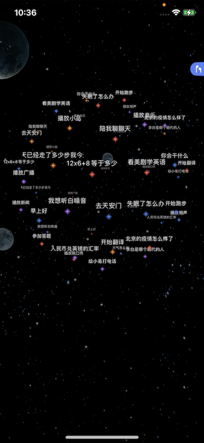
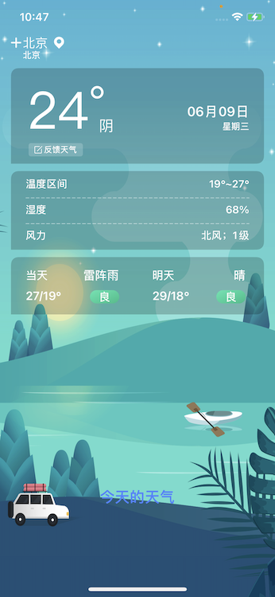

#### TA来了Demo 使用文档

下图为TA来了APP的首页截图

首页为一个旋转的球体功能展示，上面显示了TA来了的功能。

用户可以按照功能上的文字展示来语音询问控制APP。例如：用户可以按照球体上的文字信息语音：“今天的天气怎么样”，APP收到语音指令后，会进行TTS的相关播报，并跳转相应的界面展示。回答完用户的相关问题之后，回跳转回首页界面。并且首页的下方会展示，app识别到的语音文字信息。

用户也可以点击球体上的文字信息，文字信息会弹框出相关功能的详细介绍。

用户可以旋转球体来展示更多的功能标签。

右上角的蓝色标签信息来提示用户佩戴耳机，效果更佳，用户也可以点击小X号来关闭标签。

左滑界面，为个人中心界面。在这个界面内部可以修改用户的个人信息。下方有两个按钮，分别为我的设备、我的钱包。其中我的设备按钮中可以配置管理SoundAI智能音箱设备。我的钱包中可以将参与答题的余额体现至相关的支付宝账户。

首页向右侧滑动为音频播放列表界面

用户可以点击播放列表中的歌曲进行播放，之后会跳转到播放详情界面

此图为播放详情界面，用户可以在此界面查看歌词等信息。还可以切换上下首，以及相关列表的展示和播放模式的设置。

用户还可以用语音来控制app的相关操作：“上一首”、“下一首”、“循环播放”、“回到首页”等等一系列的操作。
